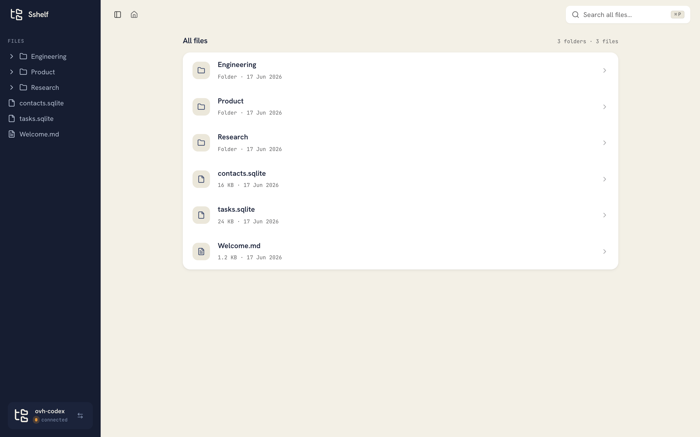
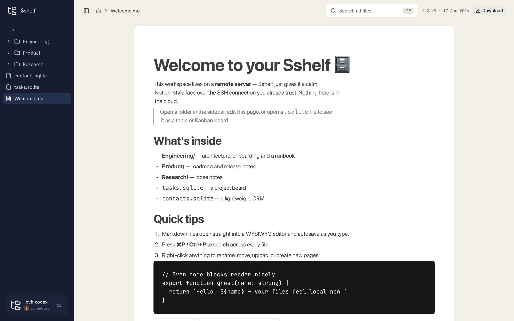
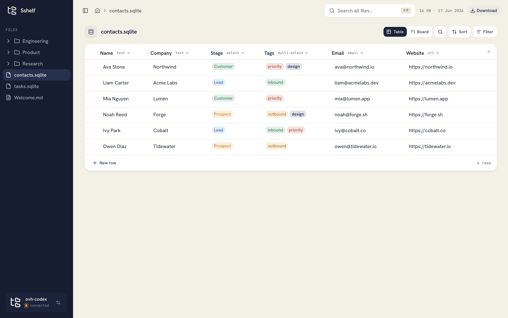
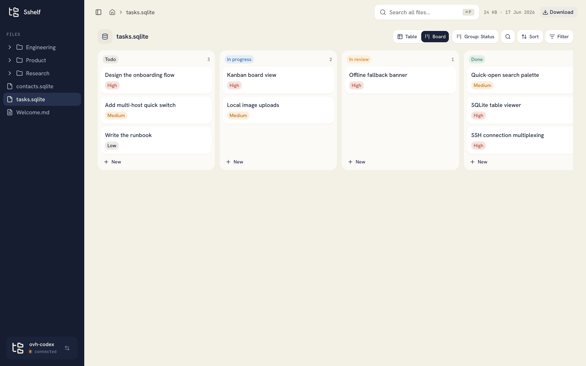

# Sshelf

**A local-first, Notion-style desktop workspace for the files on a remote SSH machine.**

Point Sshelf at a server you already SSH into, and the files living there —
notes, docs, datasets, configs — turn into a fast, friendly workspace: browse
the tree, edit Markdown in a WYSIWYG editor, open SQLite files as Notion-style
tables and Kanban boards, and search everything. No agent to install on the
server, no cloud account, no sync service. Just your machine talking to your
box over the SSH connection you already trust.

> **Status: alpha.** It works and it's used daily, but interfaces and storage
> formats may still change. Feedback and contributions welcome.

## Screenshots

|                                                           |                                                       |
| --------------------------------------------------------- | ----------------------------------------------------- |
|         |   |
| **Browse a remote tree** like a local workspace           | **Edit Markdown** in a WYSIWYG editor that autosaves  |
|  |  |
| **Open SQLite files** as Notion-style typed tables        | **Flip to a Kanban board** grouped by any column      |

## Why Sshelf exists

A lot of useful stuff lives on a remote box — a VPS, a lab server, a homelab,
a cloud VM. Notes you keep next to a project, a `crm.sqlite` a script writes
to, Markdown docs, scraped data, logs. Today the options are clumsy: `ssh` in
and use `vim`, mount the whole thing over SSHFS and hope it stays responsive,
or copy files back and forth. None of them feel like the calm, organized
workspace you get from a tool like Notion — and the tools that _do_ feel like
that demand you hand your data to someone else's cloud.

Sshelf is the missing middle. The aim is simple:

- **Make a remote filesystem feel like a Notion workspace** — readable pages,
  an inline Markdown editor, databases with typed columns and board views — not
  a terminal and not a raw file listing.
- **Keep everything where it already is.** Your files never leave the server,
  and nothing is uploaded to a third party. Sshelf runs entirely on your
  computer and only ever talks to the one SSH host you choose.
- **Reuse what you already have.** It shells out to your system `ssh`, so your
  existing `~/.ssh/config`, keys, and agent just work. There is nothing to
  install or run on the remote side.
- **Be fast enough to live in.** Aggressive caching, one-round-trip tree loads,
  and an offline fallback mean navigation feels local even though the bytes are
  on the other end of a connection.

If you keep a "second brain," a project wiki, or working data on a machine you
reach over SSH, Sshelf is meant to be the front door to it.

## What it does

- **File explorer** — browse the remote tree in a sidebar, open files, do
  full-text search across the whole tree, and create / rename / move / delete /
  upload files and folders (drag-and-drop included).
- **Markdown editor** — Markdown files open straight into a block-based WYSIWYG
  editor that autosaves over SSH as you type, with local image uploads.
- **Database views** — open a `.sqlite`/`.db` file as Notion-style tables:
  typed columns (text, number, select, status, checkbox, date, URL…), a Kanban
  **board view**, per-row Markdown pages, filtering/sorting/search, and saved
  per-table views (stored in the file itself, in a hidden sidecar table).
- **Viewers** — PDFs, images, HTML (sandboxed preview + source), and text/code
  with syntax highlighting.
- **Quick open** — ⌘P / Ctrl+P opens a command palette that searches file names
  and contents across the server.

## Quick start

```sh
bun install
bun run dev
```

Then open <http://localhost:3010>.

On first run you pick which host to connect to from your `~/.ssh/config`. The
host must already work from your terminal (`ssh <host>`); Sshelf doesn't manage
keys or credentials — it reuses yours.

## Configuration

Sshelf is configured through environment variables (all optional):

| Variable             | Default           | Description                                                     |
| -------------------- | ----------------- | --------------------------------------------------------------- |
| `SSHELF_SSH_HOST`    | _(chosen in-app)_ | SSH host to connect to. Must match an entry in `~/.ssh/config`. |
| `SSHELF_REMOTE_ROOT` | `/home/ubuntu`    | The remote directory shown as the workspace root.               |

The chosen host is also remembered between runs in `~/.sshelf.json`.

## Desktop app

The Electron shell runs the same [TanStack Start](https://tanstack.com/start)
app. In development it loads the Vite dev server; packaged builds start the
compiled server locally inside the desktop app and serve the compiled client
assets from `dist/client`.

```sh
bun run electron:dev        # run the desktop shell against the dev server
bun run electron:pack:mac   # unpacked build (macOS)
bun run electron:pack:win   # unpacked build (Windows)
```

Full distributable builds:

```sh
bun run electron:dist:mac   # Apple Silicon + Intel
bun run electron:dist:win   # x64
```

## How it works

Sshelf is a TanStack Start (React 19) app wrapped in Electron. There is no
backend service of its own — the "server" is just the local Start server that
the desktop shell embeds.

- **Transport.** It shells out to your system `ssh` using the host you picked.
  On macOS and Linux it keeps one multiplexed connection alive
  (`ControlMaster`/`ControlPersist`), so each command is ~100 ms instead of a
  full handshake. Windows uses plain OpenSSH calls.
- **One-shot tree.** The entire visible tree is fetched in a single `find` call
  and cached for 30 s, so folder navigation never touches the network. File
  contents are cached for 60 s, and data is loaded through TanStack Query, which
  dedupes requests, prefetches on hover, and keeps the cache warm across pages.
- **Databases.** SQLite files are read and written through the remote `sqlite3`
  CLI (read-only by default; writes are serialized and identifier/value-escaped
  to stay injection-safe). Notion-style column types, row pages, and saved views
  are stored in hidden sidecar tables inside the same file, so the database is
  self-describing and nothing is kept outside it.
- **Offline-safe.** If the connection drops, Sshelf keeps serving the last saved
  copy, shows an **offline** indicator with a retry button, and a banner over
  stale content. A circuit breaker fails fast for 10 s after a failure instead
  of hanging, and every command times out after 15 s.

Measured on one setup (production build): folder navigation ~1 ms, cached file
reopen ~4 ms, 304 revalidation ~11 ms, warm PDF ~11 ms, cold PDF ~260 ms.

## Project layout

- `src/server/ssh.ts` — SSH transport, caching, circuit breaker, search
- `src/server/files.ts` — file server functions used by the UI
- `src/server/database.ts` — SQLite read/write server functions
- `src/lib/queries.ts` — TanStack Query options for every read
- `src/routes/` — the explorer pages and the `/api/*` routes (raw files, upload, SSE)
- `src/components/` — sidebar, file tree, viewers, Markdown editor, database views
- `electron/` — the desktop shell and embedded server
- `src/styles.css` — design tokens (navy / paper / orange palette)

## Contributing

Contributions are welcome. See [CONTRIBUTING.md](CONTRIBUTING.md) for setup, the
quality gates (`typecheck` / `lint` / `check` / `test` / `build`), and PR
conventions.

## Name

**Sshelf** = `ssh` + _shelf_: a shelf for the files on the other end of your
SSH connection.

## License

MIT — see [LICENSE](LICENSE).
